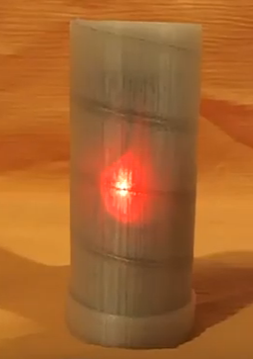
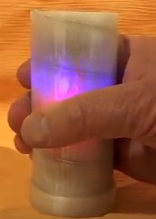

# Musical Toy

This repository contains the files needed to construct an inexpensive toy
that plays audio files when held. 

This toy was developed in response to a
request made from Makers Making Change:

https://www.makersmakingchange.com/project/conductive-touch-music-toy/

A video of the toy can be found here: https://www.youtube.com/watch?v=sac93CFT064

## Firmware

The toy uses an Arduino Nano to control a DFPlayer Mini MP3 player.  [Firmware Details](firmware/README.md)

## Bill of Materials

Item # | Description                                   | Qty | Source
-------|-----------------------------------------------|----------|-------
   1   | Arduino Nano (V3)                             |  1  | E Bay
   2   | DFPlayer Mini                                 |  1  | E Bay
   3   | 9V Battery Enclosure w/ Power Switch          |  1  | E Bay
   4   | Breadboard Friendly PCB Speaker - 8 Ohm, 0.2W |  1  | www.BuyaPi.ca / www.adafruit.com
   5   | 4GB - 32 GB SD Card                           |  1  | www.BuyaPi.ca
   6   | 9 Volt Battery                                |  1  |

## 3D Printed Parts

Item # | Description                                   
-------|-----------------------------------------------------------------------
   1   | Outer shell with embedded 24 AWG wire - acts a capacitive touch sensor [stl file](enclosure/stl_files/shell.stl)
   2   | Arduino Nano Holder [stl file](enclosure/stl_files/arduino_nano_clip.stl)
   3   | Clip to hold Speaker [stl file](enclosure/stl_files/speaker_clip.stl)
   4   | Frame to hold DFPlayer Mini, Nano frame and 9V enclosure [stl file](enclosure/stl_files/9V_surround.stl)
   5   | End Cap [stl file](enclosure/stl_files/cap.stl)

3D printed parts were designed to by printed using a 0.4mm nozzle. [Enclosure Details](enclosure/README.md)
