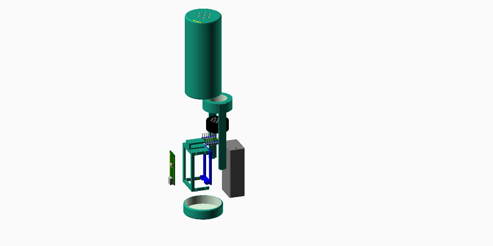
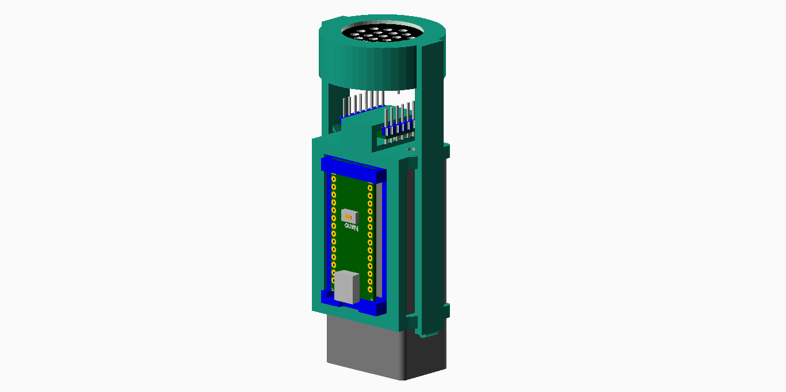

# 3D Printed Parts

## Design Software

The 3D printed part were designed using OpenSCAD version 2015.03-2 (http://www.openscad.org/)

## Assembly

Exploded view:

Interior Assembly:

The arduino nano holder (blue) should be glued to the frame (turquoise) using hot glue or super glue.
